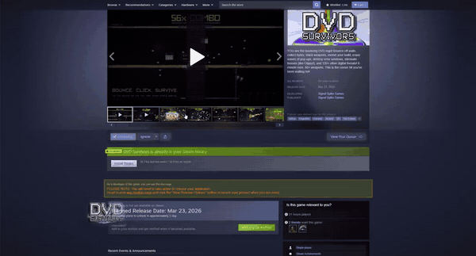

# SteamFoil

Community-driven visual enhancements for Steam store pages, verified by game developers.

SteamFoil is a browser extension that lets game developers customize their Steam store pages with CSS. Developers submit their styles to this repo, verify ownership with a token on their page, and players who install the extension see the enhanced version automatically.



## For Players

**Install the extension**, then visit any Steam store page that has SteamFoil content. Styles appear automatically — no configuration needed.

The extension icon shows a ✦ badge when a page has active SteamFoil enhancements.

### Install

1. Download the latest release from the [Releases page](https://github.com/korzewarrior/SteamFoil/releases)
2. Extract the zip to a folder
3. Open `chrome://extensions` (or `vivaldi://extensions`, `edge://extensions`)
4. Enable **Developer mode**
5. Click **Load unpacked** and select the extracted folder

### See It Live

Install the extension and visit these Steam pages to see SteamFoil in action:

- [**DVD Survivors**](https://store.steampowered.com/app/4481810/) — CRT scanlines, vignette, bouncing logo, neon gold title glow, chromatic aberration
- [**Starboys**](https://store.steampowered.com/app/3756250/) — Starfield overlay, deep space vignette, bouncing logo, nebula glow, amber gold title pulse
- [**Bloodrust**](https://store.steampowered.com/app/4469430/) — Heavy rust vignette, subtle scanlines, bouncing logo, ember glow, smoldering borders

## For Game Developers

Add visual flair to your Steam store page with custom CSS. Players with SteamFoil installed will see your styles — everyone else sees the normal page.

**[Read the full guide →](CONTRIBUTING.md)**

### Quick Start

1. Fork this repo
2. Create `games/<your-app-id>/` with a `manifest.json` and `style.css`
3. Add a verification token to your Steam page description
4. Submit a pull request

### What You Get

Write whatever CSS you want. Scanlines, glows, vignettes, custom colors, animated backgrounds — it's your page.

There is one optional built-in effect that requires JavaScript and can't be done with CSS alone:

| Effect | Description |
|--------|-------------|
| `bouncing-logo` | A logo image that bounces around the page with physics, impact squash, and hue-shifting |

Enable it in your `manifest.json` if you want it. Everything else is pure CSS in your `style.css`.

## How Verification Works

Your game's `manifest.json` contains a unique token, and that same token must appear somewhere on your Steam page (e.g., at the bottom of your game description). The extension checks for the token before applying any styles.

No accounts, no OAuth, no API keys. If you control the page, you can verify it.

## Repo Structure

```
steamfoil/
├── index.json              ← Master list of games with SteamFoil content
├── games/
│   └── <app-id>/
│       ├── manifest.json   ← Game config and verification token
│       ├── style.css       ← Custom CSS
│       └── assets/         ← Images referenced in CSS (max 5MB total)
└── extension/              ← Browser extension source
```

## License

MIT
